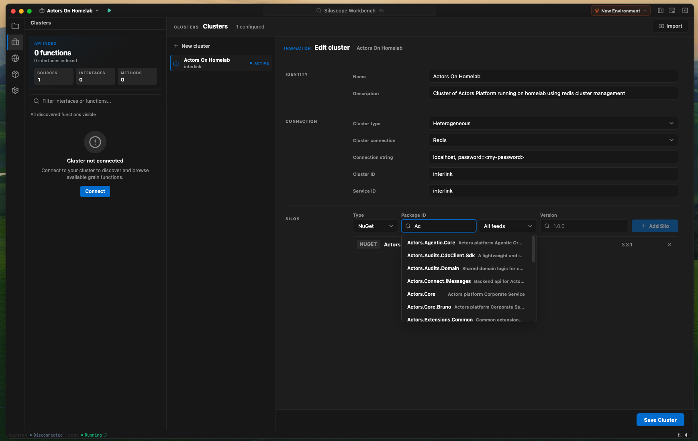
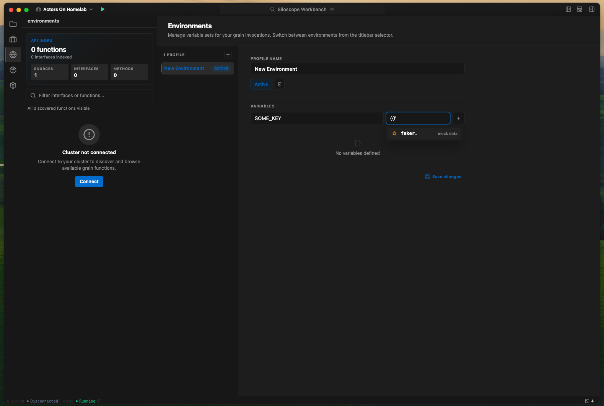
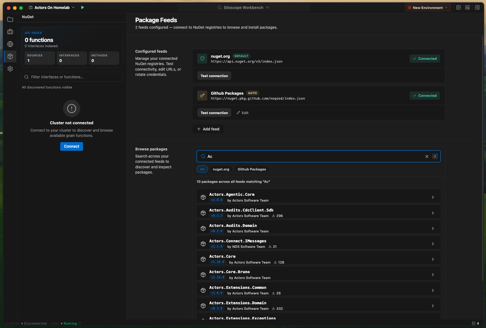
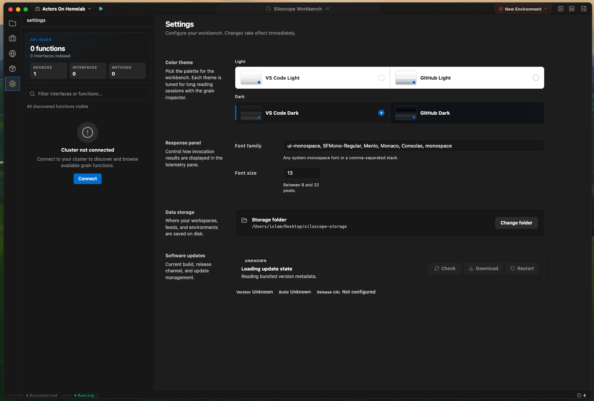
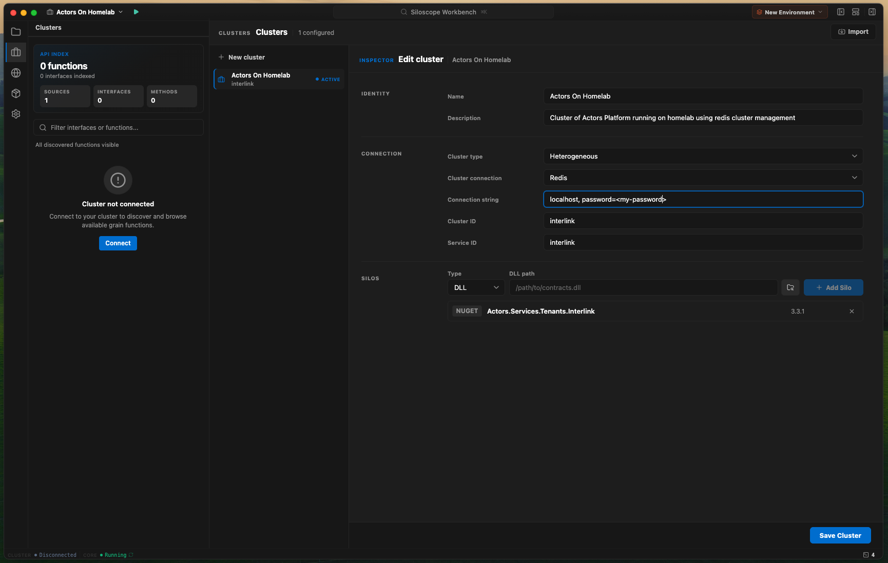
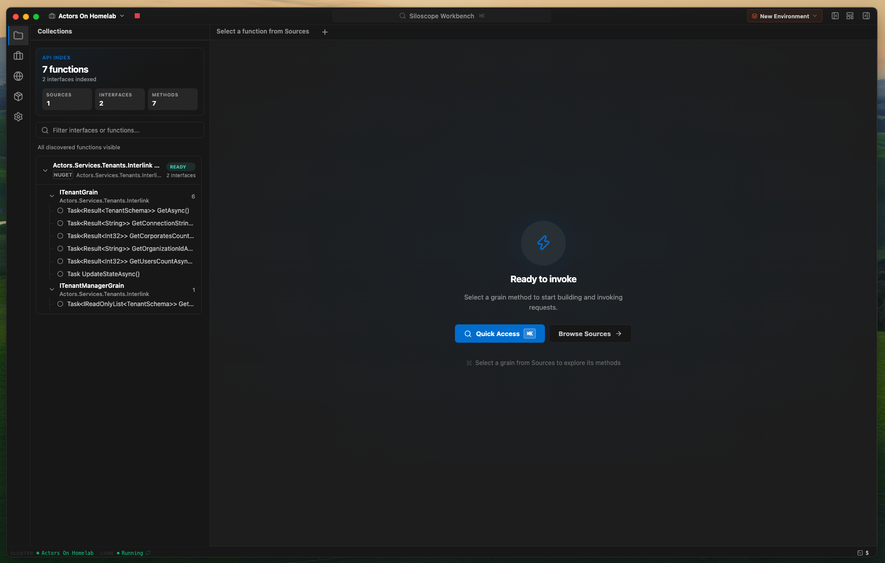
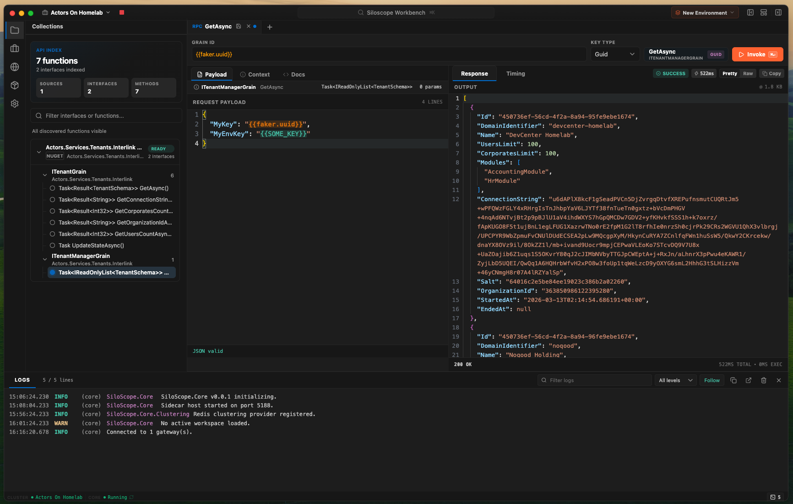

# SiloScope

  

  <strong>The developer workbench for Microsoft Orleans.</strong> 
  Explore grains, invoke methods, and debug your virtual actor cluster — 
  all from a polished desktop UI. No boilerplate. No custom clients. Just you and your cluster.

  <a href="#-download">Download</a> ·
  <a href="#-features">Features</a> ·
  <a href="#-getting-started">Getting Started</a> ·
  <a href="#-screenshots">Screenshots</a>

---

## What is SiloScope?

SiloScope bridges the gap between your local development environment and a running Orleans cluster. Think of it as **Postman for Virtual Actors** — a native desktop app that lets you discover grain interfaces, craft payloads, invoke methods, and inspect responses without writing a single line of glue code.

Point it at a local `.dll`, a NuGet package, or an already-running cluster, and SiloScope reflects every grain interface automatically. You get a rich JSON editor, response telemetry with timing breakdowns, saved request contexts, and environment-aware variable substitution — all in a familiar IDE-like layout.

---

## Features

<table>
  <tr>
    <td width="50%">
      <h3>🔍 Zero-Boilerplate Discovery</h3>
      
Point to a local assembly or search NuGet feeds. SiloScope scans your grain interfaces and surfaces every method, parameter, and return type — no custom wrappers needed.

    </td>
    <td width="50%">
      <h3>⚡ One-Click Invocation</h3>
      
Select a grain method, write your payload as JSON, and hit <strong>Send</strong>. SiloScope handles serialization, routing, and the Orleans client lifecycle behind the scenes.

    </td>
  </tr>
  <tr>
    <td>
      <h3>🧩 Multi-Cluster Workspaces</h3>
      
Save and switch between clusters as named workspaces. Each workspace remembers its connection settings, grain catalog, and saved request contexts — pick up right where you left off.

    </td>
    <td>
      <h3>🌐 Any Clustering Provider</h3>
      
Redis, ADO.NET, Azure Table Storage, or static clustering — SiloScope connects to your cluster however it's configured. Just set up the connection string and go.

    </td>
  </tr>
  <tr>
    <td>
      <h3>📦 NuGet & Local Sources</h3>
      
Add private NuGet feeds or browse nuget.org directly from the app. SiloScope downloads and extracts grain interfaces on the fly. Prefer local? Load assemblies right from disk.

    </td>
    <td>
      <h3>🌍 Environment Variables</h3>
      
Define environments (dev, staging, prod) with key-value pairs. Use <code>{{env.VAR_NAME}}</code> in your payloads and switch environments with a single click — no find-and-replace needed.

    </td>
  </tr>
  <tr>
    <td>
      <h3>📊 Response Telemetry</h3>
      
Every invocation captures the full response body, execution time, and serialization overhead. Browse your invocation history and compare timings across calls.

    </td>
    <td>
      <h3>🎨 Developer-Centric UI</h3>
      
A familiar workbench layout with resizable panels, multiple editor themes (VS Code & GitHub, light & dark), configurable fonts, and ⌘K quick-access command palette.

    </td>
  </tr>
</table>

---

## Screenshots

  
   <em>The main workbench — grain catalog on the left, JSON editor in the center, response pane on the right.</em>

  
   <em>Configure cluster connections, NuGet sources, and grain discovery in one place.</em>

  
   <em>Select a grain method, craft your JSON payload with autocomplete, and invoke.</em>

  
   <em>Inspect responses with timing breakdowns — total time, execution time, and serialization overhead.</em>

  
   <em>Browse NuGet feeds, search for Orleans grain packages, and load interfaces on the fly.</em>

  
   <em>Define per-environment variables and switch contexts with a single click.</em>

  
   <em>Pick your theme, configure fonts, manage auto-updates, and more.</em>

  
   <em>⌘K quick-access palette — jump to any grain, method, workspace, or setting instantly.</em>

---

## Download

SiloScope is available on **macOS**, **Windows**, and **Linux**.

| Platform   | Download                                                                                                                                   |
| ---------- | ------------------------------------------------------------------------------------------------------------------------------------------ |
| 🍎 macOS   | [Apple Silicon](https://github.com/etammam/silo-scope/releases/latest) · [Intel](https://github.com/etammam/silo-scope/releases/latest)    |
| 🪟 Windows | [x64 Installer](https://github.com/etammam/silo-scope/releases/latest) · [Portable](https://github.com/etammam/silo-scope/releases/latest) |
| 🐧 Linux   | [AppImage](https://github.com/etammam/silo-scope/releases/latest) · [.deb](https://github.com/etammam/silo-scope/releases/latest)          |

> Auto-updates are built in — SiloScope checks for new releases on launch and installs them with one click.

---

## Getting Started

**1. Create a workspace** — give your cluster a name and choose how to discover grain interfaces (local `.dll` or NuGet package).

**2. Configure your cluster** — pick your clustering provider (Redis, ADO.NET, Azure, or static) and enter your connection string.

**3. Connect** — hit the ▶ play button. SiloScope spins up an Orleans client, downloads any NuGet packages, and discovers every grain interface automatically.

**4. Invoke** — pick a grain method from the catalog, write your JSON payload in the editor, and send. Results appear instantly with full timing details.

---

## Built With

SiloScope pairs an **Electron** shell (React + TypeScript) with a **C# .NET sidecar** that hosts the Orleans client. The two processes communicate over JSON-RPC via stdio — the sidecar does the heavy lifting so the UI stays fast and responsive.

---

  Made for Orleans developers, by Orleans developers.

